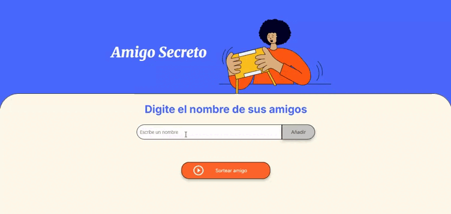

# 🎁 Amigo Secreto

## ¿Qué es?

Una aplicación web simple para jugar al "Amigo Secreto". Permite agregar nombres de amigos y sortear uno de manera aleatoria.

## 🎬 Demostración

*GIF mostrando cómo agregar nombres y realizar el sorteo*

## Funcionalidades

- ✅ Agregar nombres de amigos
- ✅ Ver lista de participantes
- ✅ Sortear un amigo aleatoriamente
- ✅ Interfaz fácil de usar

## Cómo usar

1. **Abrir la aplicación**: Abre `index.html` en tu navegador
2. **Agregar amigos**: Escribe nombres en el campo de texto y haz clic en "Añadir"
3. **Ver lista**: Los nombres aparecen en la lista debajo
4. **Sortear**: Haz clic en "Sortear amigo" para elegir uno al azar

## Archivos del proyecto

- `index.html` - Página principal
- `style.css` - Estilos y diseño
- `app.js` - Funciones de la aplicación
- `assets/` - Imágenes y recursos
  - `demo-amigo-secreto.gif` - Demostración de la aplicación

## Tecnologías

- HTML
- CSS
- JavaScript puro

**Desarrollado como proyecto de práctica de lógica de programación**
